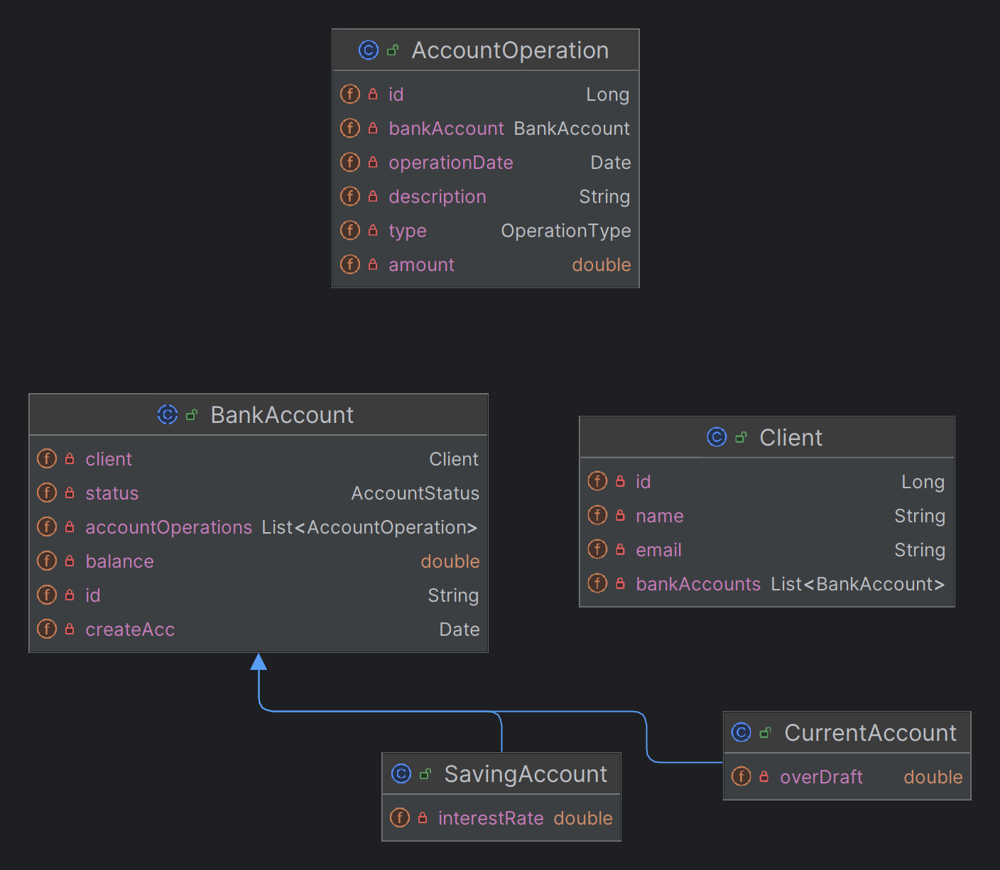
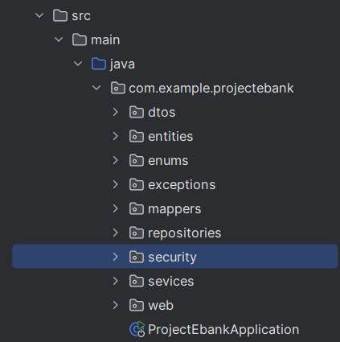
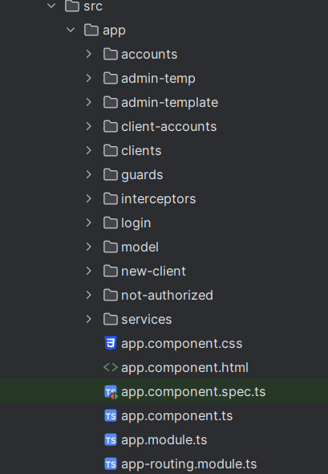
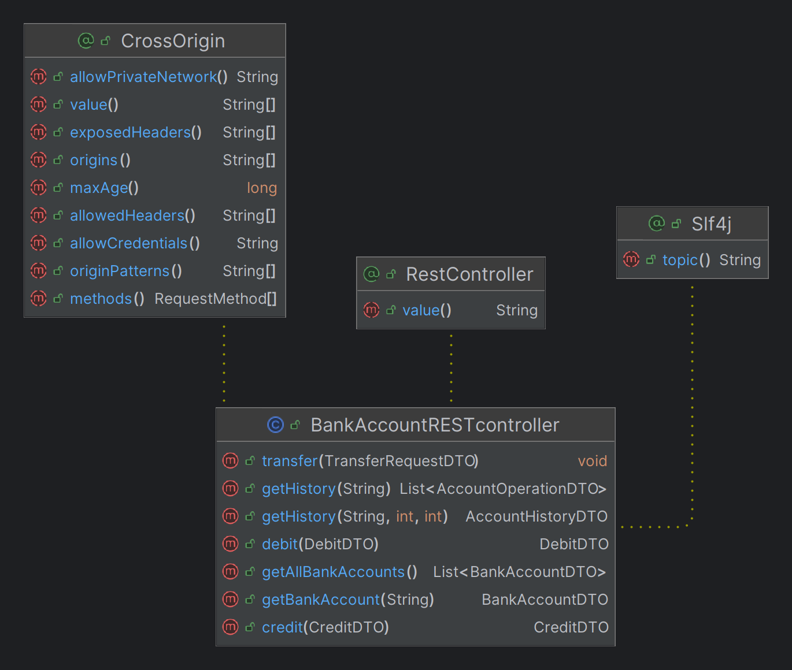
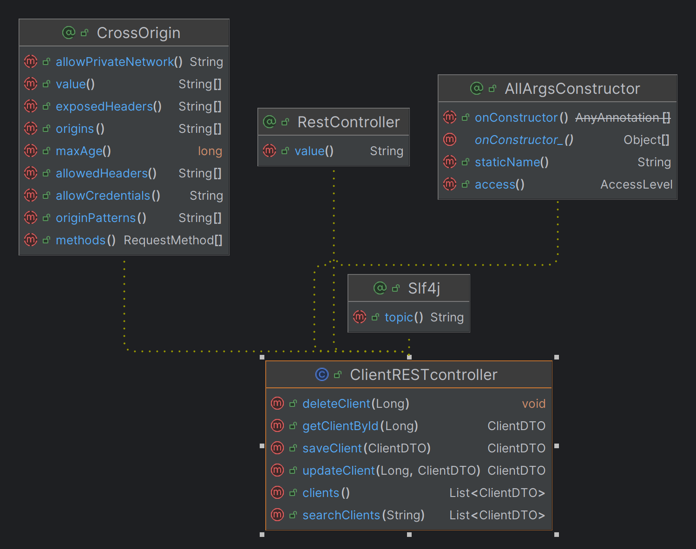

## Compte Rendu
Ce projet consiste à mettre en œuvre une application Web JEE base sur Spring MVC, JWT, Spring Data JPA et Angular qui permet la gestion des clients, leurs comptes bancaires et les transcations.
## Conception
### Entities

### DTO

## Capture D'ecran
### Architecture du Projet
#### BackEnd

#### FrontEnd

### Code
#### Rest Controllers
##### Bank Account REST Controller

###### Code Snippet
```java
package com.example.projectebank.web;

import com.example.projectebank.dtos.*;
import com.example.projectebank.exceptions.BankAccountNotFound;
import com.example.projectebank.exceptions.InsufficientBalanceException;
import com.example.projectebank.sevices.BankAccountService;
import lombok.extern.slf4j.Slf4j;
import org.springframework.web.bind.annotation.*;

import java.util.List;

@RestController
@CrossOrigin(origins = "http://localhost:4200/")
@Slf4j
public class BankAccountRESTcontroller {
    private BankAccountService bankAccountService;

    public BankAccountRESTcontroller(BankAccountService bankAccountService) {
        this.bankAccountService = bankAccountService;
    }

    @GetMapping("/accounts/{accountID}")
    public BankAccountDTO getBankAccount(@PathVariable(name = "accountID") String bankAccountId) throws BankAccountNotFound {
        return bankAccountService.getBankAccount(bankAccountId);
    }

    @GetMapping("/accounts")
    public List<BankAccountDTO> getAllBankAccounts() {
        return bankAccountService.listBankAccounts();
    }

    @GetMapping("/accounts/{id}/operations")
    public List<AccountOperationDTO> getHistory(@PathVariable("id") String accountID){
        return bankAccountService.accountOperationHistory(accountID);
    }

    @GetMapping("/accounts/{id}/pageOperations")
    public AccountHistoryDTO getHistory(@PathVariable("id") String accountID,
                                        @RequestParam(name = "page", defaultValue = "0") int page,
                                        @RequestParam(name = "size", defaultValue = "5") int size) throws BankAccountNotFound {
        return bankAccountService.getAccountHistory(accountID, page, size);
    }

    @PostMapping("/accounts/debit")
    public DebitDTO debit(@RequestBody DebitDTO debitDTO) throws InsufficientBalanceException, BankAccountNotFound {
        this.bankAccountService.debit(debitDTO.getAccountId(), debitDTO.getAmount(), debitDTO.getDescription());
        return debitDTO;
    }

    @PostMapping("/accounts/credit")
    public CreditDTO credit(@RequestBody CreditDTO creditDTO) throws InsufficientBalanceException, BankAccountNotFound {
        this.bankAccountService.credit(creditDTO.getAccountId(), creditDTO.getAmount(), creditDTO.getDescription());
        return creditDTO;
    }

    @PostMapping("/accounts/transfer")
    public void transfer(@RequestBody TransferRequestDTO transferRequestDTO) throws InsufficientBalanceException, BankAccountNotFound {
        this.bankAccountService.transfer(transferRequestDTO.getAccountSource(),
                transferRequestDTO.getAccountDestination(),
                transferRequestDTO.getAmount());
    }

}
```
##### Client REST Controller

###### Code Snippet
```java
package com.example.projectebank.web;

import com.example.projectebank.dtos.ClientDTO;
import com.example.projectebank.exceptions.ClientNotFoundException;
import com.example.projectebank.sevices.BankAccountService;
import lombok.AllArgsConstructor;
import lombok.extern.slf4j.Slf4j;
import org.springframework.security.access.prepost.PreAuthorize;
import org.springframework.web.bind.annotation.*;

import java.util.List;

@RestController
@AllArgsConstructor
@Slf4j
@CrossOrigin(origins = "http://localhost:4200/")
public class ClientRESTcontroller {
    private BankAccountService bankAccountService;
    @GetMapping("/clients")
    @PreAuthorize("hasAuthority('SCOPE_USER')")
    public List<ClientDTO> clients(){
        return bankAccountService.listClients();
    }

    @GetMapping("/clients/search")
    @PreAuthorize("hasAuthority('SCOPE_USER')")
    public List<ClientDTO> searchClients(@RequestParam(name = "keyword", defaultValue = "") String keyword){
        return bankAccountService.searchClients(keyword);
    }

    @GetMapping("/clients/{id}")
    @PreAuthorize("hasAuthority('SCOPE_USER')")
    public ClientDTO getClientById(@PathVariable(name = "id") Long clientId) throws ClientNotFoundException {
        return bankAccountService.getClientById(clientId);
    }

    @PostMapping("/clients")
    @PreAuthorize("hasAuthority('SCOPE_ADMIN')")
    public ClientDTO saveClient(@RequestBody ClientDTO clientDTO) {
        return bankAccountService.saveClient(clientDTO);
    }

    @PutMapping("/clients/{clientID}")
    @PreAuthorize("hasAuthority('SCOPE_ADMIN')")
    public ClientDTO updateClient(@PathVariable(name = "clientID") Long Id ,@RequestBody ClientDTO clientDTO) {
        clientDTO.setId(Id);
        return bankAccountService.updateClient(clientDTO);
    }

    @DeleteMapping("/clients/{clientID}")
    @PreAuthorize("hasAuthority('SCOPE_ADMIN')")
    public void deleteClient(@PathVariable(name = "clientID") Long clientId) {
        bankAccountService.deleteClient(clientId);
    }
}

```
#### Security Using JWT

##### Code Snippet
```java
package com.example.projectebank.security;

import org.springframework.beans.factory.annotation.Autowired;
import org.springframework.security.authentication.AuthenticationManager;
import org.springframework.security.authentication.UsernamePasswordAuthenticationToken;
import org.springframework.security.core.Authentication;
import org.springframework.security.core.GrantedAuthority;
import org.springframework.security.oauth2.jose.jws.MacAlgorithm;
import org.springframework.security.oauth2.jwt.*;
import org.springframework.web.bind.annotation.GetMapping;
import org.springframework.web.bind.annotation.PostMapping;
import org.springframework.web.bind.annotation.RequestMapping;
import org.springframework.web.bind.annotation.RestController;

import java.time.Instant;
import java.time.temporal.ChronoUnit;
import java.util.Map;
import java.util.stream.Collectors;

@RestController
@RequestMapping("/auth")
public class SecurityController {

    @Autowired
    private AuthenticationManager authenticationManager;
    @Autowired
    private JwtEncoder jwtEncoder;

    @GetMapping("/profile")
    public Authentication authentication(Authentication authentication){
        return authentication;
    }

    @PostMapping("/login")
    public Map<String, String> login(String username, String password){
        Authentication authentication = authenticationManager.authenticate(
                new UsernamePasswordAuthenticationToken(username, password)
        );
        Instant instant = Instant.now();
        String scope = authentication.getAuthorities().stream().map(GrantedAuthority::getAuthority).collect(Collectors.joining(" "));
        JwtClaimsSet jwtClaimsSet = JwtClaimsSet.builder()
                .issuedAt(instant)
                .expiresAt(instant.plus(10, ChronoUnit.MINUTES))
                .claim("scope", scope)
                .build();
        JwtEncoderParameters jwtEncoderParameters =
                JwtEncoderParameters.from(
                        JwsHeader.with(MacAlgorithm.HS512).build(),
                        jwtClaimsSet
                );
        String jwt = jwtEncoder.encode(jwtEncoderParameters).getTokenValue();
        return Map.of("access_token", jwt);
    }
}

```
#### Front End
##### Account TS Code Snippet
Gere toutes les transactions concernant un compte
```ts
import {Component, OnInit} from '@angular/core';
import {FormBuilder, FormGroup} from "@angular/forms";
import {AccountsService} from "../services/accounts.service";
import {catchError, Observable, throwError} from "rxjs";
import {AccountDetails} from "../model/account.model";
import {AuthService} from "../services/auth.service";

@Component({
  selector: 'app-accounts',
  templateUrl: './accounts.component.html',
  styleUrl: './accounts.component.css'
})
export class AccountsComponent implements OnInit{

  accountFormGroup! : FormGroup
  currentPage : number = 0
  pageSize:number = 5;
  accountObservable! : Observable<AccountDetails>
  operationFormGroup! : FormGroup
  errorMessage!: string

  constructor(private fb : FormBuilder,
              private accountService : AccountsService,
              public authService: AuthService) {
  }

  ngOnInit() {
    this.accountFormGroup = this.fb.group({
      accountId : this.fb.control('')
    })

    this.operationFormGroup=this.fb.group({
      operationType: this.fb.control(null),
      amount: this.fb.control(0),
      description : this.fb.control(null),
      accountDestination: this.fb.control(null)
    })
  }

  handleSearchAccount() {
    let accountId : string = this.accountFormGroup.value.accountId
    this.accountObservable = this.accountService.getAccount(accountId, this.currentPage, this.pageSize).pipe(
      catchError(err => {
        this.errorMessage=err.message
        return throwError(err)
      })
    )
  }

  gotoPage(page: number) {
    this.currentPage=page
    this.handleSearchAccount()
  }

  handleAccountOperation() {
    let accountId : string = this.accountFormGroup.value.accountId
    let operationType: string = this.operationFormGroup.value.operationType
    let amount: number = this.operationFormGroup.value.amount
    let description: string = this.operationFormGroup.value.description
    let accountDestination: string = this.operationFormGroup.value.accountDestination
    if (operationType=='Debit'){
      this.accountService.debit(accountId, amount, description).subscribe({
        next: (data) => {
          alert("Succes Debit")
          this.operationFormGroup.reset()
          this.handleAccountOperation()
        },
        error: err => {
          console.log(err)
        }
      })
    } else if (operationType=='Credit'){
      this.accountService.credit(accountId, amount, description).subscribe({
        next: (data) => {
          alert("Success Credit")
          this.operationFormGroup.reset()
          this.handleAccountOperation()
        },
        error: err => {
          console.log(err)
        }
      })
    }else if (operationType=='Transfer'){
      this.accountService.transfer(accountId, accountDestination, amount, description).subscribe({
        next: (data) => {
          alert("Succes Transfer")
          this.operationFormGroup.reset()
          this.handleAccountOperation()
        },
        error: err => {
          console.log(err)
        }
      })
    }
  }
}
```
##### Client TS Code Snippet
```ts
import {Component, OnInit, ViewChild} from '@angular/core';
import {MatPaginator} from "@angular/material/paginator";
import {ClientService} from "../services/client.service";
import {FormBuilder, FormGroup} from "@angular/forms";
import {catchError, map, Observable, throwError} from "rxjs";
import {Client} from "../model/client.model";
import {Router} from "@angular/router";

@Component({
  selector: 'app-clients',
  templateUrl: './clients.component.html',
  styleUrl: './clients.component.css'
})
export class ClientsComponent implements OnInit{
  public clients! : Observable<Array<Client>>
  public error! : string
  public searchFormGroup! : FormGroup

  @ViewChild(MatPaginator) paginator ! : MatPaginator
  constructor(private clientService : ClientService, private fb : FormBuilder, private router: Router) {
  }


  ngOnInit() {
    this.searchFormGroup = this.fb.group({
      keyword: this.fb.control("")
    })
    this.handleSearchClient()
  }

  handleSearchClient() {
    let kw = this.searchFormGroup?.value.keyword
    this.clients = this.clientService.searchClients(kw).pipe(
      catchError(err => {
        this.error = err.message
        return throwError(() => new Error(err))
      })
    )

  }

  handleDeleteClient(c: Client) {
    let conf = confirm("Are you sure?")
    if (!conf) return
    this.clientService.deleteClient(c.id).subscribe({
      next:(resp) => {
        this.clients = this.clients.pipe(
          map(data => {
            let index = data.indexOf(c)
            data.slice(index, 1)
            return data
          })
        );
      },
      error: err => {
        console.log(err)
      }
    })
  }

  handleClientAccounts(client: Client) {
    this.router.navigateByUrl("client-accounts/"+client.id, {state: client})
  }
}
```
###### Client-Account TS Code Snippet
```ts
import {Component, OnInit} from '@angular/core';
import {ActivatedRoute, Router} from "@angular/router";
import {Client} from "../model/client.model";
import {ClientsComponent} from "../clients/clients.component";

@Component({
    selector: 'app-client-accounts',
    templateUrl: './client-accounts.component.html',
    styleUrl: './client-accounts.component.css'
})
export class ClientAccountsComponent implements OnInit{
    clientId!: string
    client!: Client
    constructor(private route: ActivatedRoute, private router: Router) {
        this.client = this.router.getCurrentNavigation()?.extras.state as Client
    }

    ngOnInit() {
        this.clientId = this.route.snapshot.params['id']

    }
}
```
